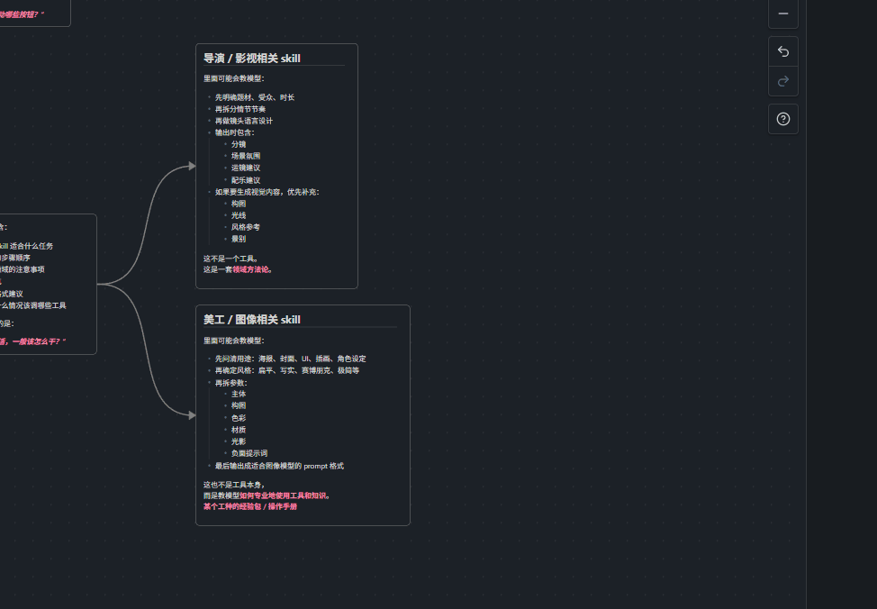

# Vault Pilot

Vault Pilot 是一个面向个人知识库工作流的 Obsidian 插件，重点解决 3 类高频动作：

- Canvas 脑图式节点创建、自动排布、文本节点尺寸自适应
- 在 Markdown / Canvas 中快速插入 NAS 视频直链卡片
- 一键提交并推送当前仓库到 Git


## 功能概览

### 1. Canvas 智能脑图工作流

- 支持快速创建子节点
- 支持快速创建兄弟节点
- 自动从当前节点重新排布整棵树
- 文本节点在编辑/预览切换时自动调整尺寸，减少手动拖拽



适合用来整理主题拆解、知识树、流程图草稿和 Agent 结构图。

### 2. 插入 NAS 视频直链

- 可在 Markdown 中插入视频 HTML
- 也可直接在 Canvas 中生成视频卡片
- 会尝试按设置的后缀顺序自动寻找封面图
- 自动读取视频尺寸，用更合适的卡片大小插入


这部分适合把 NAS、本地服务或局域网媒体资源直接接进笔记，而不是手动写一长串 HTML。

### 3. 一键推送仓库

- `git add -A`
- 自动生成提交信息
- 没有变更时跳过 commit
- 最后执行 `git push`

适合把整个 Obsidian 仓库快速同步到 GitHub 或其他 Git 远端。

## 当前命令

- `插入 NAS 视频`
- `一键推送仓库`
- `Canvas：智能创建子节点`
- `Canvas：智能创建兄弟节点`

此外，插件还会注册一个侧边栏火箭图标，用于快速执行“一键推送仓库”。

## 设置项

目前插件提供 3 个核心设置：

- `Git 仓库路径`
  留空时默认使用当前 Obsidian 仓库根目录。
- `封面后缀优先级`
  用于查找视频封面，例如 `png,jpg,webp`。
- `Git 提交前缀`
  一键推送时会拼接时间戳生成最终提交信息。

## 安装

### 手动安装

将以下文件放到你的 Obsidian 插件目录：

- `main.js`
- `manifest.json`
- `styles.css`

目录结构示例：

```text
.obsidian/plugins/vault-pilot/
```

然后在 Obsidian 中打开：

`设置 -> 社区插件 -> 已安装插件 -> Vault Pilot`

### 开发安装

```bash
npm install
npm run dev
```

生产构建：

```bash
npm run build
```

构建产物会直接输出到当前插件目录。

## 项目定位

Vault Pilot 不是那种只做单一小功能的插件，它更像是一个围绕知识库生产流程的工具箱，当前重点放在：

- Canvas 编辑效率
- 媒体内容插入
- 仓库同步

后续会继续往“更稳定、更可配置、更适合公开发布”这个方向推进。


## 适用场景

- 用 Obsidian Canvas 做脑图、知识树、结构拆解
- 把 NAS / 局域网视频资料纳入笔记系统
- 希望把整个仓库快速同步到 Git 远端

## License

MIT
